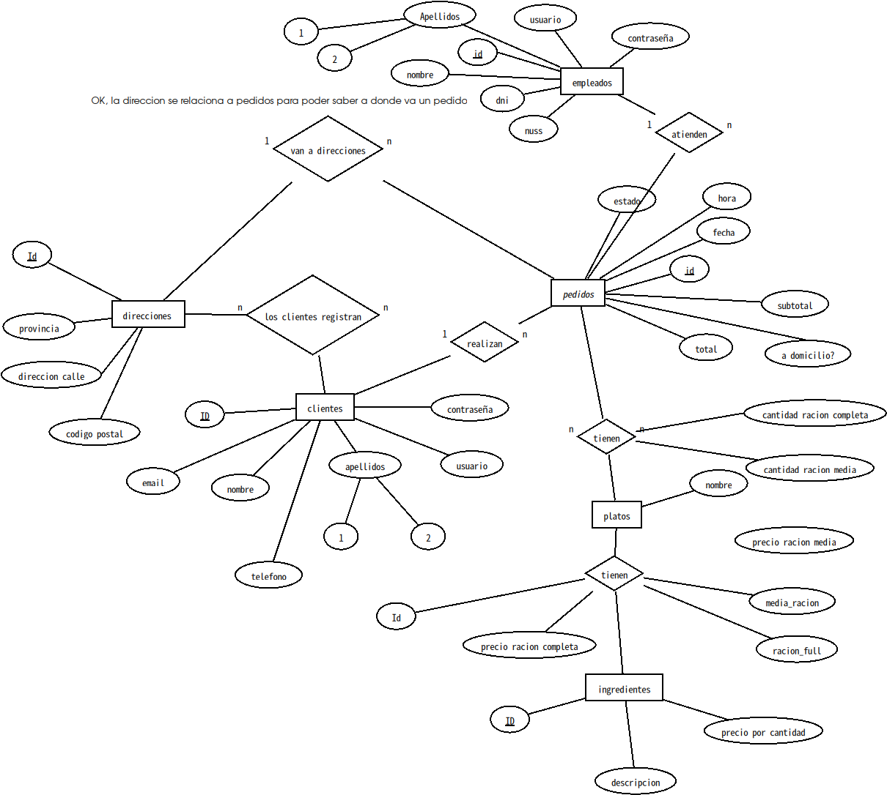
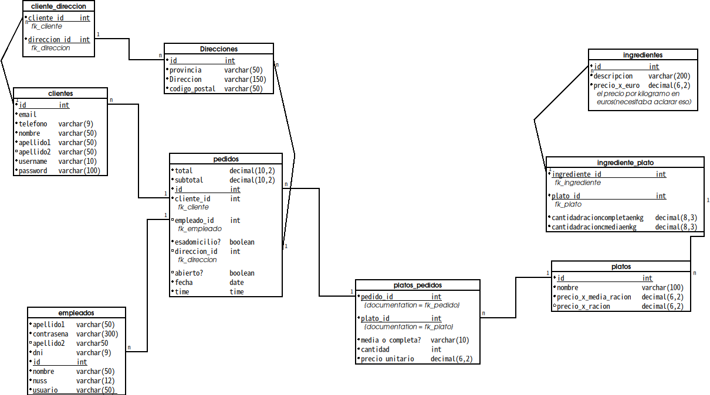

# 🍷 Poly Bodeguita

**Sistema de Gestión de Restaurante — Proyecto de Base de Datos**

> Autor: **Cristian García**  
> Asignatura: Base de Datos · Curso 2025–2026  
> Stack: MariaDB 11.8 · Docker · REST API (mariadb2apirest) · HTML/CSS/JS (Vanilla)

---

## 📋 Índice

1. [Descripción General](#descripción-general)
2. [Arquitectura del Sistema](#arquitectura-del-sistema)
3. [Requisitos Previos](#requisitos-previos)
4. [Instalación y Puesta en Marcha](#instalación-y-puesta-en-marcha)
5. [Esquema de Base de Datos](#esquema-de-base-de-datos)
6. [API REST](#api-rest)
7. [Interfaz Web (Frontend)](#interfaz-web-frontend)
8. [Procedimientos Almacenados](#procedimientos-almacenados)
9. [Vistas y Funciones](#vistas-y-funciones)
10. [Examen SQL](#examen-sql)
11. [Estructura de Archivos](#estructura-de-archivos)
12. [Apagar el Sistema](#apagar-el-sistema)

---

## Descripción General

**Poly Bodeguita** es un sistema completo de gestión para un restaurante/bodeguita sevillana. Permite gestionar:

- **Clientes** y sus direcciones de entrega
- **Empleados** con autenticación
- **Carta de platos** con precios por ración completa y media
- **Pedidos** tanto en local como a domicilio, con cálculo automático de IVA y recargos
- **Ingredientes** y su relación con los platos (para análisis de rentabilidad)
- **Estadísticas** de ventas, rentabilidad por plato y cliente estrella

El proyecto se compone de tres capas principales desplegadas con Docker:

```
┌────────────────────────────────────┐
│       Frontend (HTML/JS/CSS)       │  ← Puerto 5500
│   Index Hub + Employee Portal      │
├────────────────────────────────────┤
│       API REST Dinámica            │  ← Puerto 3000
│    (mariadb2apirest - Docker)      │
├────────────────────────────────────┤
│         MariaDB 11.8               │  ← Puerto 3306
│      (Docker Container)            │
└────────────────────────────────────┘
```

---

## Arquitectura del Sistema

### Flujo de Datos

1. El **usuario** (empleado) accede a la interfaz web desde su navegador en el puerto `5500`.
2. La interfaz web hace peticiones HTTP (GET, POST, PUT) a la **API REST** en el puerto `3000`.
3. La API traduce automáticamente las peticiones HTTP en consultas SQL contra la **base de datos MariaDB** en el puerto `3306`.
4. La API genera automáticamente endpoints CRUD para cada tabla de la base de datos (sin necesidad de código backend manual).

### Red Docker

Los contenedores se comunican a través de una red Docker bridge llamada `mariadb_default`:

- **`mariadb_container`**: Servidor MariaDB. El usuario debe tenerlo corriendo **previamente**.
- **`dynamic-api`**: API REST auto-generada. Se conecta al contenedor MariaDB por nombre de contenedor dentro de la red Docker.

---

## Requisitos Previos

Antes de arrancar el proyecto, asegúrate de tener instalado:

| Requisito | Versión Mínima | Propósito |
|-----------|---------------|-----------|
| **Docker** | 20.x+ | Contenerizar la API y la base de datos |
| **Docker Compose** | 2.x+ | Orquestación de contenedores |
| **Python 3** | 3.6+ | Servir los archivos estáticos del frontend |
| **Git** | 2.x+ | Control de versiones |

### ⚠️ Requisito Obligatorio: Contenedor MariaDB

El usuario **debe tener el contenedor MariaDB corriendo previamente** en una red Docker llamada `mariadb_default`. El contenedor debe llamarse `mariadb_container` y utilizar la contraseña de root `54321Ba##`.

Si no tienes el contenedor MariaDB, puedes crearlo manualmente:

```bash
docker run -d \
  --name mariadb_container \
  --network mariadb_default \
  -e MYSQL_ROOT_PASSWORD='54321Ba##' \
  -p 3306:3306 \
  mariadb:11.8
```

O si prefieres usar un `docker-compose.yml` dedicado, crea uno con la configuración adecuada.

---

## Instalación y Puesta en Marcha

### 1. Clonar el repositorio

```bash
git clone https://github.com/cristiangarcia07-ux/poly_bodeguita.git
cd poly_bodeguita
```

### 2. Asegurarse de que MariaDB está corriendo

```bash
docker ps | grep mariadb_container
```
**asegurate DE QUE ESTE EN FUNCIONAMIENTO**
Si no está corriendo, arráncalo (ver sección [Requisitos Previos](#requisitos-previos)).

### 3. Arrancar todo

```bash
chmod +x run_server.sh stop_server.sh
./run_server.sh
```

El script `run_server.sh` realiza los siguientes pasos automáticamente:

1. **Arranca el contenedor de la API** (`dynamic-api`) usando Docker Compose desde el directorio `swagger-ui/`.
2. **Espera 10 segundos** a que MariaDB esté listo para aceptar conexiones.
3. **Carga el esquema completo en segundo plano** (`schema.sql`) en MariaDB usando `nohup`, lo cual:
   - Crea la base de datos `poly_bodeguita`
   - Crea todas las tablas
   - Inserta los datos del menú (platos, ingredientes, relaciones)
   - Ejecuta los procedimientos para generar clientes y pedidos aleatorios
   - Crea las vistas y funciones de estadísticas
   > ⚠️ **La carga de la BD se ejecuta en background (`nohup`)**. El servidor web arranca inmediatamente después, pero la base de datos puede tardar unos minutos en estar completamente poblada. Esto es completamente normal: la API estará disponible antes de que los datos estén listos, así que espera un momento antes de usarla si acabas de arrancar el sistema por primera vez.
4. **Arranca el servidor web Python** en el puerto `5500`, enlazado a `0.0.0.0` para acceso desde la red local.
5. **Muestra las URLs** de acceso (local y de red).

### 4. Acceder al sistema

Tras arrancar, verás algo como:

```
  🚀 Poly Bodeguita - Starting Web Server
  📍 Root: /home/usaurio/proyecto bbdd puffy
  🌐 Local URL:   http://localhost:5500
  🌐 Network URL: http://192.168.x.x:5500
```

- **Desde tu máquina**: http://localhost:5500
- **Desde otros dispositivos en tu red**: http://TU_IP:5500

---

## Esquema de Base de Datos

### Diagrama Entidad-Relación



### Diagrama de Tablas



### Tablas

#### `clientes`
Almacena los datos de los clientes del restaurante.

| Columna | Tipo | Restricciones | Descripción |
|---------|------|---------------|-------------|
| `id` | INT | PK, AUTO_INCREMENT | Identificador único |
| `email` | VARCHAR(100) | NOT NULL, UNIQUE | Correo electrónico |
| `telefono` | VARCHAR(9) | NOT NULL | Teléfono español (9 dígitos) |
| `nombre` | VARCHAR(50) | NOT NULL | Nombre de pila |
| `apellido1` | VARCHAR(50) | NOT NULL | Primer apellido |
| `apellido2` | VARCHAR(50) | Nullable | Segundo apellido |
| `username` | VARCHAR(10) | NOT NULL | Nombre de usuario |
| `password` | VARCHAR(100) | NOT NULL | Contraseña (hash SHA-256 para generados) |

#### `empleados`
Datos de los empleados que operan el sistema.

| Columna | Tipo | Restricciones | Descripción |
|---------|------|---------------|-------------|
| `id` | INT | PK, AUTO_INCREMENT | Identificador único |
| `nombre` | VARCHAR(50) | NOT NULL | Nombre |
| `apellido1` | VARCHAR(50) | NOT NULL | Primer apellido |
| `apellido2` | VARCHAR(50) | Nullable | Segundo apellido |
| `dni` | VARCHAR(9) | NOT NULL, UNIQUE | DNI español |
| `nuss` | VARCHAR(12) | NOT NULL, UNIQUE | Número Seguridad Social |
| `usuario` | VARCHAR(50) | NOT NULL, UNIQUE | Login de acceso |
| `contrasena` | VARCHAR(300) | NOT NULL | Contraseña |

**Empleados de prueba:**

| Usuario | Contraseña | Nombre |
|---------|-----------|--------|
| `cruiz` | `password123` | Carlos Ruiz García |
| `lgomez` | `secure456` | Lucía Gómez Sánchez |
| `pfernandez` | `paco789` | Paco Fernández López |

#### `Direcciones`
Direcciones de entrega disponibles.

| Columna | Tipo | Restricciones | Descripción |
|---------|------|---------------|-------------|
| `id` | INT | PK, AUTO_INCREMENT | Identificador único |
| `provincia` | VARCHAR(50) | NOT NULL | Provincia (Sevilla, Málaga) |
| `Direccion` | VARCHAR(150) | NOT NULL | Dirección completa |
| `codigo_postal` | VARCHAR(50) | NOT NULL | Código postal |

#### `cliente_direccion`
Tabla intermedia N:M que vincula clientes con sus direcciones.

| Columna | Tipo | Restricciones | Descripción |
|---------|------|---------------|-------------|
| `cliente_id` | INT | PK, FK → clientes | ID del cliente |
| `direccion_id` | INT | PK, FK → Direcciones | ID de la dirección |

#### `pedidos`
Cabecera de cada pedido realizado.

| Columna | Tipo | Restricciones | Descripción |
|---------|------|---------------|-------------|
| `id` | INT | PK, AUTO_INCREMENT | Identificador del pedido |
| `total` | DECIMAL(10,2) | NOT NULL | Importe total (subtotal + IVA + recargo) |
| `subtotal` | DECIMAL(10,2) | NOT NULL | Suma de los platos sin impuestos |
| `cliente_id` | INT | NOT NULL, FK → clientes | Cliente que realiza el pedido |
| `empleado_id` | INT | NOT NULL, FK → empleados | Empleado que atiende |
| `esadomicilio` | BOOLEAN | NOT NULL, DEFAULT FALSE | Si el pedido es para entregar |
| `direccion_id` | INT | Nullable, FK → Direcciones | Dirección de entrega (si aplica) |
| `abierto` | BOOLEAN | NOT NULL, DEFAULT TRUE | Estado del pedido (abierto/cerrado) |
| `fecha` | DATE | DEFAULT CURRENT_DATE | Fecha del pedido |
| `time` | TIME | DEFAULT CURRENT_TIME | Hora del pedido |

#### `platos`
Carta del restaurante.

| Columna | Tipo | Restricciones | Descripción |
|---------|------|---------------|-------------|
| `id` | INT | PK, AUTO_INCREMENT | Identificador |
| `nombre` | VARCHAR(100) | NOT NULL | Nombre del plato |
| `precio_x_media_racion` | DECIMAL(6,2) | Nullable | Precio media ración (NULL si no disponible) |
| `precio_x_racion` | DECIMAL(6,2) | NOT NULL | Precio ración completa |

**Categorías del menú:** Carnes (7), Pescados (9), Chacinas (6), Otros Platos (3), Entremeses (11), Mariscos (5), Bebidas (17)

#### `platos_pedidos`
Detalle de línea de cada pedido (qué platos contiene).

| Columna | Tipo | Restricciones | Descripción |
|---------|------|---------------|-------------|
| `pedido_id` | INT | PK, FK → pedidos | Pedido al que pertenece |
| `plato_id` | INT | PK, FK → platos | Plato seleccionado |
| `tipo_racion` | VARCHAR(10) | NOT NULL | `'media'` o `'completa'` |
| `cantidad` | INT | NOT NULL | Unidades pedidas |
| `precio_unitario` | DECIMAL(6,2) | NOT NULL | Precio unitario aplicado |

#### `Ingredientes`
Ingredientes base con sus precios de mercado.

| Columna | Tipo | Restricciones | Descripción |
|---------|------|---------------|-------------|
| `id` | INT | PK, AUTO_INCREMENT | Identificador |
| `descripcion` | VARCHAR(200) | NOT NULL | Nombre del ingrediente |
| `precio_x_euro` | DECIMAL(6,2) | NOT NULL | Precio por kilogramo (€/kg) |

#### `ingrediente_plato`
Relación N:M entre ingredientes y platos, con las cantidades necesarias.

| Columna | Tipo | Restricciones | Descripción |
|---------|------|---------------|-------------|
| `ingrediente_id` | INT | PK, FK → Ingredientes | Ingrediente |
| `plato_id` | INT | PK, FK → platos | Plato |
| `cantidadracioncompletaenkg` | DECIMAL(8,3) | Nullable | Kg por ración completa |
| `cantidadracioncmediaenkg` | DECIMAL(8,3) | Nullable | Kg por media ración |

---

## API REST

La API se genera **automáticamente** a partir de las tablas de la base de datos usando la imagen Docker `bernat13/mariadb2apirest`. No requiere código backend manual.

### Configuración (`swagger-ui/docker-compose.yml`)

```yaml
services:
  api:
    image: bernat13/mariadb2apirest:main
    container_name: dynamic-api
    ports:
      - "3000:3000"
    environment:
      DB_HOST: mariadb_container
      DB_PORT: 3306
      DB_USER: root
      DB_PASSWORD: "54321Ba##"
      DB_NAME: poly_bodeguita
      PORT: 3000
    networks:
      - mariadb_default
```

### Endpoints Generados Automáticamente

Para cada tabla, la API genera los siguientes endpoints:

| Método | Endpoint | Descripción |
|--------|----------|-------------|
| `GET` | `/clientes` | Lista todos los clientes |
| `GET` | `/clientes/:id` | Obtiene un cliente por ID |
| `POST` | `/clientes` | Crea un nuevo cliente |
| `PUT` | `/clientes/:id` | Actualiza un cliente |
| `DELETE` | `/clientes/:id` | Elimina un cliente |

Lo mismo aplica para: `/empleados`, `/pedidos`, `/platos`, `/platos_pedidos`, `/Direcciones`, `/Ingredientes`, `/ingrediente_plato`, `/cliente_direccion`.

### Acceso a la API

- **Local**: http://localhost:3000
- **Red**: http://TU_IP:3000

---

## Interfaz Web (Frontend)

### Hub Principal (`index.html`)

Punto de entrada con tres enlaces:

- **Employee UI**: Portal para empleados (gestión de pedidos)
- **API Docs**: Documentación Swagger de la API
- **Exam Portal**: Interfaz de examen para estudiantes

Diseño: Dark mode con glassmorphism, tipografía Outfit, paleta dorada (`#c9a050`).

### Portal de Empleados (`restaurant-ui/`)

Aplicación Single Page (SPA) compuesta por:

| Archivo | Propósito |
|---------|-----------|
| `index.html` | Estructura HTML con pantallas de login, dashboard y gestión de clientes |
| `style.css` | Estilos glassmorphism, dark mode, responsive |
| `app.v2.js` | Lógica completa (V2): autenticación, CRUD pedidos, gestión de clientes, carrito |

#### Funcionalidades:

1. **Login**: Autentica empleados contra la tabla `empleados` vía la API.
2. **Dashboard**: Muestra estadísticas (pedidos activos, revenue total) y la tabla de pedidos recientes.
3. **Gestión de Clientes**: Feature para añadir nuevos clientes al sistema directamente desde el portal.
4. **Crear Pedido**: Modal con:
   - Selector de cliente
   - Tipo de pedido (local / domicilio)
   - Selector de dirección (solo para domicilio)
   - Grid de platos con búsqueda
   - Carrito con resumen (subtotal, IVA 21%, recargo domicilio 2.50€)
5. **Editar/Cerrar/Reabrir Pedidos**: Ciclo de vida completo del pedido desde la tabla.

#### Configuración de Red

La API base se configura dinámicamente para funcionar tanto en local como en red:

```javascript
const API_BASE = `http://${window.location.hostname}:3000`;
```

Esto permite que si accedes desde `http://192.168.x.x:5500`, las peticiones a la API irán a `http://192.168.x.x:3000` automáticamente.

---

## Procedimientos Almacenados

### `GenerarClientesAleatorios(cantidad INT)`

Genera clientes de prueba combinando nombres y apellidos de una tabla temporal de 100 entradas.

- **Teléfono**: Genera números españoles aleatorios (6XXXXXXXX)
- **Email**: Combina nombre + apellido + UUID_SHORT para garantizar unicidad
- **Password**: Hash SHA-256 aleatorio
- **Uso**: `CALL GenerarClientesAleatorios(100);`

### `GenerarPedidosAleatorios(num_pedidos INT)`

Genera pedidos históricos (cerrados) con datos realistas:

- Escoge cliente, empleado y tipo de pedido al azar
- Para pedidos a domicilio, usa la dirección real del cliente
- Cada pedido tiene entre 1 y 5 platos distintos
- Decide aleatoriamente entre media y ración completa
- Calcula subtotal y total (con recargo de 2.50€ si es domicilio)
- **Uso**: `CALL GenerarPedidosAleatorios(500);`

### `AbrirPedido(p_cliente_id, p_empleado_id, p_direccion_id, p_es_a_domicilio)`

Crea un nuevo pedido vacío marcado como **abierto**.

- Inserta la cabecera con total y subtotal a 0
- Devuelve el registro del pedido creado

### `AñadirPlatoAPedido(p_pedido_id, p_gratis, p_plato_id, p_tipo_racion, p_cantidad)`

Añade un plato a un pedido existente:

1. Comprueba que el pedido existe
2. Obtiene el precio real de la tabla `platos` según tipo de ración
3. Si `p_gratis = TRUE`, el precio unitario se pone a 0
4. Inserta o actualiza la línea (ON DUPLICATE KEY UPDATE)
5. Recalcula el subtotal sumando todas las líneas
6. Aplica IVA del 21% y recargo de domicilio si procede
7. Devuelve el pedido actualizado y el detalle del ticket

### `CerrarPedido(p_pedido_id)`

Marca un pedido como cerrado (`abierto = FALSE`).

---

## Vistas y Funciones

### Vista: `RentabilidadPlatos`

Muestra la rentabilidad de cada plato comparando ingresos vs coste de ingredientes:

| Columna | Descripción |
|---------|-------------|
| `Plato` | Nombre del plato |
| `Total_Vendido` | Unidades vendidas en total |
| `Ingresos_Totales` | Dinero facturado |
| `Coste_Ingredientes_Estimado` | Coste estimado basado en ingredientes y cantidades |
| `Beneficio_Neto` | Ingresos - Costes |

```sql
SELECT * FROM RentabilidadPlatos ORDER BY Beneficio_Neto DESC;
```

### Función: `ObtenerMejorCliente()`

Devuelve el email del cliente que más dinero ha gastado en total.

```sql
SELECT ObtenerMejorCliente();
```

---

## Examen SQL

El proyecto incluye un sistema de examen SQL con interfaz temática Windows XP:

| Archivo | Descripción |
|---------|-------------|
| `examen_windows_xp.html` | Interfaz del **profesor** — contiene preguntas y soluciones |
| `examen_estudiante_windows_xp.html` | Interfaz del **estudiante** — solo preguntas |
| `GarciaCristian_ExamenResuelto.sql` | Soluciones SQL del examen |
| `soluciones_examen.sql` | Archivo adicional de soluciones |
| `GarciaCristian_Examen10preguntas.pdf` | Examen en formato PDF (10 preguntas) |
| `GarciaCristian_Examen15preguntas.pdf` | Examen en formato PDF (15 preguntas) |
| `GarciaCristian_Procedureyfuncion.sql` | Procedimientos y funciones del examen |

---

## Estructura de Archivos

```
poly_bodeguita/
│
├── 📄 README.md                              ← Este documento
├── 📄 index.html                             ← Hub principal del proyecto
├── 📄 schema.sql                             ← Esquema completo (tablas + datos + procedimientos)
├── 🖼️ GarciaCristian_DiagramaER.png          ← Diagrama Entidad-Relación
├── 🖼️ GarciaCristian_DiagramaTablas.png      ← Diagrama de tablas
├── 📄 .gitignore                             ← Archivos excluidos de Git
│
├── 🚀 run_server.sh                          ← Script de arranque (API + DB + Web)
├── 🛑 stop_server.sh                         ← Script de parada limpia
│
├── 📁 restaurant-ui/                         ← Interfaz web para empleados
│   ├── index.html                            ←   Estructura HTML (login + dashboard + clientes)
│   ├── style.css                             ←   Estilos (glassmorphism, dark mode)
│   └── app.v2.js                             ←   Lógica JS (V2: auth, CRUD, clientes, carrito)
│
├── 📁 swagger-ui/                            ← Configuración del contenedor API
│   └── docker-compose.yml                    ←   Definición del servicio API REST
│
├── 📄 GarciaCristian_ScriptCrearBBDD.sql     ← Solo creación de tablas (sin datos)
├── 📄 GarciaCristian_ScriptRellenadoTablas.sql← Script de inserción de datos
├── 📄 GarciaCristian_Procedureyfuncion.sql   ← Procedimientos y funciones
│
├── 📄 examen_windows_xp.html                 ← Examen SQL — vista profesor
├── 📄 examen_estudiante_windows_xp.html      ← Examen SQL — vista estudiante
├── 📄 GarciaCristian_ExamenResuelto.sql      ← Soluciones del examen
├── 📄 GarciaCristian_Examen_Official.html    ← Examen oficial HTML
├── 📄 GarciaCristian_Examen10preguntas.pdf   ← Examen PDF (10 preguntas)
├── 📄 GarciaCristian_Examen15preguntas.pdf   ← Examen PDF (15 preguntas)
├── 📄 soluciones_examen.sql                  ← Soluciones adicionales
│
└── 📄 data-Cxm69DLhyrXcfulmahKiI.json       ← Datos exportados (Supabase)
```

---

## Apagar el Sistema

```bash
./stop_server.sh
```

Este script:

1. Detiene el contenedor de la API (`dynamic-api`)
2. Detiene el contenedor de MariaDB (`mariadb_container`)
3. Mata el proceso del servidor web Python

---

## 📝 Notas Adicionales

- **No se usa CASCADE DELETE**: Las foreign keys no tienen `ON DELETE CASCADE` por diseño, para evitar borrados accidentales en cascada.
- **Datos de prueba**: El script genera 5.000 clientes aleatorios y el doble de pedidos cada vez que se ejecuta `schema.sql`. Como el script hace `DROP DATABASE IF EXISTS` primero, los datos son frescos en cada arranque.
- **IVA**: Se aplica un 21% sobre el subtotal. Los pedidos a domicilio tienen un recargo fijo de 2.50€.
- **Acceso en red**: El servidor web se enlaza a `0.0.0.0` y la API base se configura dinámicamente con `window.location.hostname`, lo que permite acceso desde cualquier dispositivo de la red local.
- **Carga en background**: La población de la base de datos se lanza con `nohup` en segundo plano para que el servidor web arranque inmediatamente sin esperar a que terminen los `CALL` de generación de datos. Si la API devuelve tablas vacías recién arrancado, espera 1-2 minutos a que el proceso de fondo termine.


## gracias por leer esto, y pasa un buen dia https://github.com/bernat13/

```
:::::::::------------==----::::::::::::::::---:::::::::::::
---------===------=======--+*:--:-#*:::::----::::::::::::::
------========-----=====--#@=---:=@*:------::::::::::::::::
-----==++++===------===--%@#-=---%@#-------::::::::--:::-::
---====+++====------=---%@@====-*@@#--=---:::::::::-------:
--===================--#@@%=+==*@@@*-==---::::---------::--
=====================-*@@@*++=#@@@@*===----:::-----:--::---
==+++++++++==========+@@@@#++%@@@@@+===----:++=:-----------
++++++++==========++=#@@@@@@@@@@@@#-::::::-+==-----------==
=================++++%@@@@@@@@@@@%::----==---==============
-----============++==%@@@@@@@@@@@=-=-=++-==================
----===========---::-*@@@@@@@@@@==-=+=-=====++=============
--==========-:::--==-:=@@@*-+@%--=+=-======================
==========-----======--%@@++%*-.:--========================
=======+++============-+%%#*#@@=..:==++====================
=-=====+*+============++==*@@%+-..:-=++=++++++++++=========
---=================++=+#@@*+=-:...-=+++++++++++++++++++===
--=============+++++==#@%+==-::--:::=+++++++++++++++++++++=
--===========++***++#%#+=-::-+++++-:=*+++++++++++++++++++++
------======++**++##+==-:-++++++++=:-++++++++++++++++++++++
-----======+++=+**===-:-=++++++++++:-++++++++++++++++++++++
----====++++++*+==++-:-+++++++++++-:-++++++++++*+++++++++++
--===++++==-+==+++++--+++++++++++-:-+++++++++++++++++++++++
===++++=--:-=+++++++++++++++++++==+++++++++++++++++++++++++
=++++++==#@@@#++@@*%@#++++++++++++++*%#*+++++++++++++++++++
+++++++*@@%*%@@*@@*%@%*@@@@%*%@@@@%#@@@%#@@@%#@@@@#++++++++
+++++++#@@#+*##*@@*%@%#@@@@@*%@%*@@#%@@*#@@**@@**@@*+++++++
+++++++*%@@@@@#*@@*%@%%@@@@@%@@%*@@##@@%%@@*+%@@@@%*+++++++
+++++++++++*++++**++*+++*++**+*++***+******+++****+++++++++
+++++++++++++++++++++++++++++++++++++++++++++++++++++++++++
```